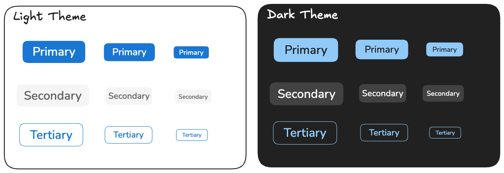

# ButtonComponent

This project includes a flexible and accessible <app-button> component built using Angular. It supports multiple variants (primary, secondary, tertiary), icon integration, loading states, and link behavior. Additionaly due to token nature it can be easily themed for different color schemes and more variants or sizes could be added

### Original sketch



---

## How to Run

1. Install dependencies:

```
npm install
```

2. Run the playground app:

```
npm start
```

3. Run tests:

```
npm test
```

4. Lint the source:

```
npm run lint
```

5. Build the library:

```
ng build ui-kit
```

---

## Overview

The `<app-button>` component is a ui-kit component that enables application design to be consisted throughout the application. It provides customization and theming while maintaining accessibility best practices. The component is responsive, keyboard-accessible, supports icons, and includes a loading state for async operations.

---

## API

### Inputs

| Name         | Type                                   | Description                                       |
| ------------ | -------------------------------------- | ------------------------------------------------- |
| type         | 'primary' \| 'secondary' \| 'tertiary' | Defines the visual style of the button            |
| size         | 'small' \| 'medium' \| 'large'         | Controls the size and spacing                     |
| disabled     | boolean                                | Disables the button, preventing user interaction  |
| loading      | boolean                                | Displays a spinner instead of the content         |
| icon         | string                                 | Optional icon name (e.g., FontAwesome icon class) |
| iconPosition | 'left' \| 'right'                      | Position of the icon relative to the label        |
| href         | string                                 | If present, the button renders as a link (`<a>`)  |

### Outputs

| Name  | Type       | Description                          |
| ----- | ---------- | ------------------------------------ |
| click | MouseEvent | Triggered when the button is clicked |

---

## Usage Examples

### Basic Usage

`<app-button type="primary">Click Me</app-button>`

### With Icon

`<app-button type="primary" icon="arrow-right" iconPosition="right">Next</app-button>`

### Disabled State

`<app-button type="secondary" [disabled]="true">Disabled</app-button>`

### Loading State

`<app-button type="primary" [loading]="true">Save</app-button>`

### As a Link

`<app-button href="https://example.com" type="tertiary">Go to example.com</app-button>`

---

## Design Guidelines

### When to Use Each Type

| Type    | Description                                                                                   | Example                                                                                       |
|------------|-----------------------------------------------------------------------------------------------|-----------------------------------------------------------------------------------------------|
| **Primary**   | Used for the main call-to-action on a screen. There should typically be only one per view.   | On a modal asking “Are you sure?”, the **Continue** or **Save** button is **Primary**.       |
| **Secondary** | Used for actions that support the primary one but are not the main focus.                    | A **Cancel** button next to a **Save** in a form is **Secondary**.                            |
| **Tertiary**  | Used for less prominent actions, or when styling should be minimal (e.g. just a text link). | In a settings page, a **Reset to Defaults** button can be **Tertiary**.                      |

### Best Practices

- Avoid using too many primary buttons on one screen.
- Use `loading` to indicate async operations and disable the button to prevent duplicate actions.
- Use `href` for navigational links to ensure proper accessibility semantics.

## Live Playground

The playground app (served with `npm start`) allows you to interactively explore all button variants, sizes, and states. Great for designers or QA to test combinations visually.

---

## Ideas for the future improvements

1. Introduce toggled buttons
2. Introduce icon-only buttons
3. Form integration
4. Transitioning from custom components to a ui-kit like PrimeNG could be beneficial in a long run


## Development Notes

- Style tokens are defined in `/styles/tokens/`
- Button styles are modular and generated from maps
